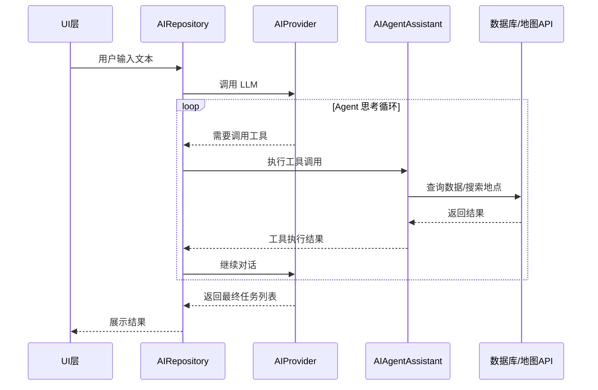

# LiteTask

<div align="center">

一款轻量化的任务管理应用，基于语音识别和大模型分析简化日程创建流程

[中文](README.md) | [English](README.en.md)

[](https://github.com/cdz-hy/LiteTask/releases)[](LICENSE)[](https://developer.android.com)

</div>

## 应用截图

<div align="center">

| 主界面 | 甘特图视图 | 截止日视图 |
| :---: | :---: | :---: |
|  |  |  |


| AI 语音录入 (流程) | 任务详情 | 桌面小组件 (样式) |
| :---: | :---: | :---: |
|    |  | <br><br><br><br> |

</div>

## 核心特性

### AI 智能录入与 Agent 模式
- 点击说话或输入文本，AI 自动解析任务信息
- 支持批量任务创建和自然语言识别
- 实时语音识别，可编辑确认后提交
- 解析地理位置并在任务中关联地图组件
- Agent 可自动分析现有日程，支持通过自然语言进行任务修改、延期、批量调整等复杂干预
- Agent 可识别模糊地点，获取当前定位并检索附近真实地址
- **多模态输入**：支持选择最多 5 张图片辅助任务分析（需配合多模态模型）
- **提供商与模型选择**：支持 DeepSeek、小米 MIMO 等多种 LLM，可自定义模型名称
- **Agent 并行工具调用**：多个工具并发执行，大幅缩短 Agent 响应时间

### AI 子任务拆解
- 针对复杂目标，可借助 AI 将其分解为数条具体、可执行的子任务
- 支持输入补充说明，按照特定重点或方向进行拆解
- 支持图片辅助拆解，AI 结合图片内容生成更精准的子任务
- 可对子任务分析结果进行修改、重排序等

### 每日日程建议
- 每日首次进入应用自动生成个性化日程建议
- Agent 自主调用 10 种工具（用户画像、未完成任务、路线计算、天气查询等）生成建议
- 分为短期建议与长期建议，卡片式展示，支持阅读标记
- 支持关闭 Agent 模式后使用直接生成模式（基础功能）

### 用户数据与画像
- **数据看板**：任务完成率、分类分布、时间趋势等多维度统计图表
- **用户画像**：AI 自动分析行为模式，识别身份、行业、活跃时段、性格特征等
- **常用地址**：基于历史任务自动识别常去地点，辅助路线规划
- 画像历史记录，追踪个人习惯变化

### 多维度可视化
- **时间线视图**：日常任务概览，左侧色条区分类别
- **甘特图视图**：时间跨度可视化，把控整体进度
- **截止日视图**：聚焦紧急任务，按紧急度分组排列

### 任务管理体系
- 父任务承载目标和时间段，子任务分解具体执行步骤
- 进度条实时反馈完成情况
- 支持地图位置、路线规划等多样化附件扩展
- 支持任务置顶、分类、提醒

### 自定义分类与颜色
- 预置工作、生活、学习、紧急四大分类
- 支持自定义分类名称、颜色（HEX）

### 任务强提醒
- 支持自定义提醒时间：任务开始时、截止前n小时/天等
- 全屏提醒弹窗（锁屏可显示），可配置声音与振动

### 桌面小组件
- 任务列表小组件：快速查看待办事项
- 甘特图小组件：时间安排一目了然
- 截止日小组件：紧急任务桌面提醒

### 数据备份与恢复
- 全量导出为 JSON 文件（任务、子任务、分类、提醒、组件等）
- 导入时自动识别重复任务（基于标题+时间+类型指纹），防止数据冗余
- 分类智能合并，跨设备迁移无缝衔接

## 下载安装

前往 [Releases](https://github.com/cdz-hy/LiteTask/releases) 页面下载最新版本 APK

**系统要求**：Android 8.0 (API 26) 及以上

## 技术实现

### 架构设计
- **UI 层**：Jetpack Compose + Material Design 3
- **数据层**：Room Database + Repository 模式
- **依赖注入**：Hilt
- **异步处理**：Kotlin Coroutines + Flow

### 核心技术栈
```
Kotlin 1.9+
Jetpack Compose - 声明式 UI
Room - 本地数据持久化
Hilt - 依赖注入
Retrofit + OkHttp - 网络请求框架
AMap Rest API - 地理编码与周边搜索
EncryptedSharedPreferences - 安全存储
```

### AI 与 Agent 集成
- 支持 DeepSeek 等多种 LLM 提供商，采用适配器模式实现灵活扩展
- 自然语言解析为结构化任务数据
- 记录 AI 处理历史
- Agent 架构，基于 Tool-Calling 机制，实现 AI 对本地数据库（检索/修改）及地图 API 的主动调度
- 地理辅助，集成高德地图周边搜索 (POI)，实现从“语义”到“坐标”的转换
- **注意**：AI功能需要在应用「设置」界面中配置您自己的 API Key（如 DeepSeek）。

#### Agent 调用结构



**核心组件**：
- **AIRepository**：协调 AI 调用流程
- **AIProvider**：对接 LLM API（DeepSeek 等）
- **AIAgentAssistant**：提供工具定义和执行（查询任务、搜索地点等）
- **任务分析工具集**：get_recent_tasks、search_tasks、get_task_details、get_categories、get_user_location、search_nearby_location
- **日程建议工具集**：get_user_profile、get_incomplete_tasks、get_task_details、search_completed_similar_tasks、get_user_location、calculate_route、get_weather、search_nearby_location、get_categories、get_past_task_performance

### 数据模型
```kotlin
Task (任务主表)
├── id, title, description, startTime, deadline
├── isDone, isPinned, isExpired, categoryId
└── createdAt, completedAt, expiredAt

SubTask (子任务表)              Category (分类表)
├── taskId (FK)                 ├── id, name, colorHex
├── content, isCompleted        └── iconName, isDefault
└── sortOrder

Reminder (提醒表)               TaskComponent (组件表)
├── taskId (FK)                 ├── taskId (FK), componentType
├── triggerAt, label            └── dataPayload (JSON), createdAt
└── isFired

AIHistory (AI 历史表)           DailyScheduleAdvice (日程建议表)
├── content, sourceType         ├── createdAt, shortTermJson
└── parsedCount, isSuccess      ├── longTermJson, isRead
                                └── generationStatus

UserProfile (用户画像表)        UserLocation (常用地址表)
├── userIdentity, industry      ├── name, address, lat, lng
├── personalityTraits           └── frequency, lastUsedAt
├── peakHours, taskStats
└── transportMode, confidence
```

## 项目结构

```
app/src/main/java/com/litetask/app/
├── data/
│   ├── ai/              # AI 提供商适配与 Agent 助手
│   ├── local/           # Room DAO & Database
│   ├── model/           # 数据模型
│   ├── remote/          # 网络 API
│   ├── repository/      # 数据仓库
│   └── speech/          # 语音识别
├── di/                  # Hilt 依赖注入
├── reminder/            # 提醒调度与通知
├── ui/
│   ├── backup/          # 数据备份与恢复
│   ├── components/      # 可复用组件
│   ├── home/            # 主页 (Timeline/Gantt/Deadline)
│   ├── search/          # 搜索界面
│   ├── settings/        # 设置界面
│   ├── userdata/        # 用户数据与画像
│   └── theme/           # Material 3 主题
├── util/                # 工具类
└── widget/              # 桌面小组件 (列表/甘特/截止)
```

## 开发环境

- Android Studio Hedgehog 或更高版本
- Kotlin 1.9+
- Gradle 8.0+
- JDK 17+
- Android SDK 26+

## 构建项目

```bash
# 克隆仓库
git clone https://github.com/cdz-hy/LiteTask.git

# 打开项目
# 使用 Android Studio 打开项目根目录

# 构建运行
# 点击 Run 按钮或使用命令行
./gradlew assembleDebug

# 配置 API Key
#  安装应用后在设置界面配置 DeepSeek API Key 等以启用 AI 功能

```

## 主要依赖

| 库 | 版本 | 用途 |
|---|---|---|
| Jetpack Compose | 1.5+ | UI 框架 |
| Room | 2.6+ | 数据库 |
| Hilt | 2.48+ | 依赖注入 |
| Retrofit | 2.9+ | 网络请求 |
| OkHttp | 4.12+ | HTTP 客户端 |
| Kotlin Coroutines | 1.7+ | 异步编程 |
| Gson | 2.10+ | JSON 序列化 |

## 设计理念

### Material Design 3
- 遵循 Google Material Design 3 规范
- 大圆角、动态取色、模态浮层
- 流畅的微交互动效

## 贡献指南

欢迎提交 [Issues](https://github.com/cdz-hy/LiteTask/issues) 和 Pull Request

## 许可证

本项目采用 MIT 许可证 - 查看 [LICENSE](LICENSE) 文件了解详情
