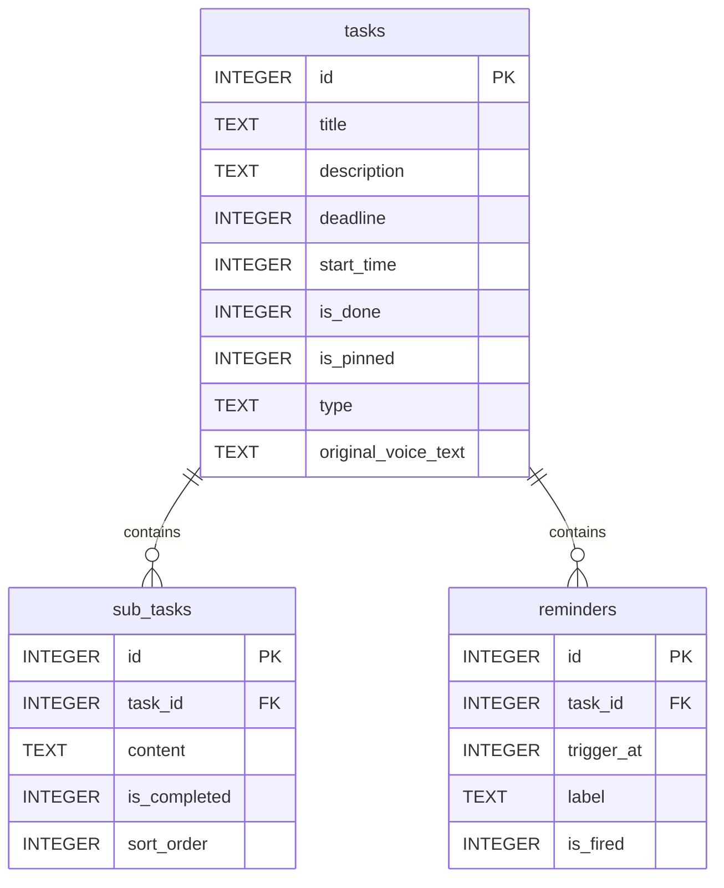

# LiteTask 数据库结构详解

LiteTask 使用 Room 持久化库作为本地数据库解决方案，采用 SQLite 作为底层存储引擎。数据库设计完全围绕 DDL（截止日期）驱动的理念，通过三个核心实体表来支撑整个应用的功能。

## 数据库概览

| 项目 | 说明 |
|------|------|
| 数据库名称 | LiteTask |
| 版本 | 1 |
| 实体数量 | 3 |
| 主要功能 | 任务管理、子任务跟踪、提醒设置 |

## 实体表结构详解

### 1. tasks 表（主任务表）

主任务表是整个应用的核心，承载着任务的基本信息和DDL驱动的关键字段。

| 字段名 | Room属性名 | 数据类型 | 非空约束 | 索引 | 默认值 | 说明 |
|--------|------------|----------|----------|------|--------|------|
| id | id | INTEGER | PRIMARY KEY AUTOINCREMENT | 否 | 0 | 主键，自动生成 |
| title | title | TEXT | 是 | 否 | 无 | 任务标题 |
| description | description | TEXT | 否 | 否 | NULL | 任务描述 |
| deadline | deadline | INTEGER | 是 | 是 | 无 | 截止时间戳（毫秒），DDL驱动核心 |
| start_time | startTime | INTEGER | 是 | 否 | 当前时间戳 | 开始时间戳（毫秒） |
| is_done | isDone | INTEGER | 是 | 是 | 0 (false) | 是否完成 |
| is_pinned | isPinned | INTEGER | 是 | 是 | 0 (false) | 是否置顶 |
| type | type | TEXT | 是 | 否 | "WORK" | 任务类型 |
| original_voice_text | originalVoiceText | TEXT | 否 | 否 | NULL | 原始语音文本 |

#### 索引说明

1. `deadline` 索引：用于首页列表按截止时间排序查询
2. `is_done` 索引：用于筛选已完成和未完成任务
3. `is_pinned` 索引：用于筛选置顶任务

#### 设计理念

- **DDL驱动**：仅保留[startTime](file:///e:/LiteTask/app/src/main/java/com/litetask/app/ui/home/HomeViewModel.kt#L85-L85)和[deadline](file:///e:/LiteTask/app/src/main/java/com/litetask/app/data/model/TaskEntity.kt#L35-L35)两个时间字段，去除传统的endTime概念
- **倒计时核心**：[deadline](file:///e:/LiteTask/app/src/main/java/com/litetask/app/data/model/TaskEntity.kt#L35-L35)字段是整个应用UI展示的核心依据
- **视觉权重**：[isPinned](file:///e:/LiteTask/app/src/main/java/com/litetask/app/data/model/TaskEntity.kt#L49-L49)字段允许用户手动调整任务显示优先级

### 2. sub_tasks 表（子任务表）

子任务表实现了任务分解功能，支持将复杂任务拆分成可执行的小步骤。

| 字段名 | Room属性名 | 数据类型 | 非空约束 | 索引 | 默认值 | 说明 |
|--------|------------|----------|----------|------|--------|------|
| id | id | INTEGER | PRIMARY KEY AUTOINCREMENT | 否 | 0 | 主键，自动生成 |
| task_id | taskId | INTEGER | 是 | 是 | 无 | 关联的主任务ID（外键） |
| content | content | TEXT | 是 | 否 | 无 | 子任务内容 |
| is_completed | isCompleted | INTEGER | 是 | 否 | 0 (false) | 是否完成 |
| sort_order | sortOrder | INTEGER | 是 | 否 | 0 | 排序权重 |

#### 外键约束

- `task_id` 字段引用 [tasks.id](file:///e:/LiteTask/app/src/main/java/com/litetask/app/data/model/TaskEntity.kt#L17-L22)，并设置了级联删除：
  - 当主任务被删除时，所有关联的子任务将自动删除

#### 设计理念

- **执行阶梯**：将宏大目标分解为可执行的小步骤
- **进度追踪**：通过子任务完成情况提供额外的进度反馈
- **有序执行**：[sortOrder](file:///e:/LiteTask/app/src/main/java/com/litetask/app/data/model/SubTask.kt#L32-L32)确保子任务按预定顺序执行

### 3. reminders 表（提醒表）

提醒表支持多重提醒机制，确保重要任务不会被遗忘。

| 字段名 | Room属性名 | 数据类型 | 非空约束 | 索引 | 默认值 | 说明 |
|--------|------------|----------|----------|------|--------|------|
| id | id | INTEGER | PRIMARY KEY AUTOINCREMENT | 否 | 0 | 主键，自动生成 |
| task_id | taskId | INTEGER | 是 | 是 | 无 | 关联的主任务ID（外键） |
| trigger_at | triggerAt | INTEGER | 是 | 否 | 无 | 触发时间戳（毫秒） |
| label | label | TEXT | 否 | 否 | NULL | 提醒标签/说明 |
| is_fired | isFired | INTEGER | 是 | 否 | 0 (false) | 是否已触发 |

#### 外键约束

- `task_id` 字段引用 [tasks.id](file:///e:/LiteTask/app/src/main/java/com/litetask/app/data/model/TaskEntity.kt#L17-L22)，并设置了级联删除：
  - 当主任务被删除时，所有关联的提醒将自动删除

#### 设计理念

- **多重保障**：一个任务可以设置多个提醒时间点
- **灵活配置**：支持在截止前不同时间点提醒（如提前一天、一小时等）
- **状态追踪**：[isFired](file:///e:/LiteTask/app/src/main/java/com/litetask/app/data/model/Reminder.kt#L35-L35)字段记录提醒是否已触发，避免重复通知

## 实体关系图



## 核心查询逻辑

### 首页任务列表查询

```sql
SELECT * FROM tasks 
WHERE is_done = 0 
ORDER BY is_pinned DESC, deadline ASC
```

查询逻辑：
1. 只显示未完成的任务（is_done = 0）
2. 置顶任务优先显示（is_pinned DESC）
3. 其余任务按截止时间由近到远排序（deadline ASC）

### 紧急任务查询

```sql
SELECT * FROM tasks 
WHERE is_done = 0 
AND deadline <= :limitTime
ORDER BY deadline ASC
```

查询逻辑：
1. 只显示未完成的任务
2. 筛选出指定时间范围内即将截止的任务
3. 按截止时间由近到远排序

### 任务详情查询

通过Room的关系注解实现关联查询：
- 主任务信息
- 所有关联的子任务
- 所有关联的提醒

## 数据完整性保障

1. **外键约束**：子任务和提醒通过外键与主任务关联，支持级联删除
2. **索引优化**：关键查询字段建立索引，提高查询性能
3. **非空约束**：必要字段设置非空约束，保证数据完整性
4. **类型安全**：使用Room的类型转换器处理枚举类型

## 扩展性考虑

1. **字段预留**：保留了[originalVoiceText](file:///e:/LiteTask/app/src/main/java/com/litetask/app/data/model/TaskEntity.kt#L55-L55)字段用于AI溯源
2. **索引策略**：关键业务字段均已建立索引
3. **关系设计**：采用一对多关系，便于后续功能扩展

## 版本演进策略

当前为版本1，后续可通过以下方式进行升级：
1. 使用Room的迁移机制处理数据库结构变更
2. 通过增加新表或字段扩展现有功能
3. 优化索引和查询逻辑提升性能