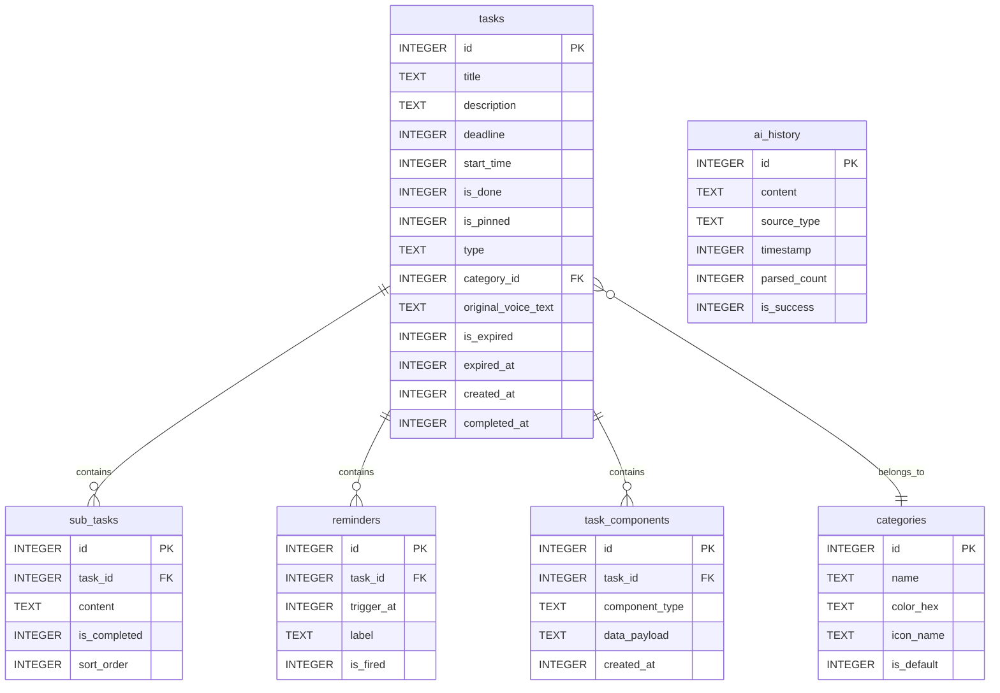

# LiteTask 数据库结构详解

LiteTask 使用 Room 持久化库作为本地数据库解决方案，采用 SQLite 作为底层存储引擎。数据库设计完全围绕 DDL（截止日期）驱动的理念，通过六个核心实体表来支撑整个应用的功能。

## 数据库概览

| 项目 | 说明 |
|------|------|
| 数据库名称 | litetask.db |
| 版本 | 5 |
| 实体数量 | 6 |
| 主要功能 | 任务管理、子任务跟踪、提醒设置、分类管理、任务组件、AI 历史 |

## 实体表结构详解

### 1. tasks 表（主任务表）

主任务表是整个应用的核心，承载着任务的基本信息和 DDL 驱动的关键字段。

| 字段名 | Room属性名 | 数据类型 | 非空约束 | 索引 | 默认值 | 说明 |
|--------|------------|----------|----------|------|--------|------|
| id | id | INTEGER | PRIMARY KEY AUTOINCREMENT | — | 0 | 主键，自动生成 |
| title | title | TEXT | 是 | 否 | 无 | 任务标题 |
| description | description | TEXT | 否 | 否 | NULL | 任务描述 |
| deadline | deadline | INTEGER | 是 | 是 | 无 | 截止时间戳（毫秒），DDL 驱动核心 |
| start_time | startTime | INTEGER | 是 | 否 | 当前时间戳 | 开始时间戳（毫秒） |
| is_done | isDone | INTEGER | 是 | 是 | 0 (false) | 是否完成 |
| is_pinned | isPinned | INTEGER | 是 | 是 | 0 (false) | 是否置顶 |
| type | type | TEXT | 是 | 否 | "WORK" | 任务类型（已废弃，保留兼容） |
| category_id | categoryId | INTEGER | 是 | 是 | 1 | 分类 ID（外键关联 categories） |
| original_voice_text | originalVoiceText | TEXT | 否 | 否 | NULL | 原始语音文本 |
| is_expired | isExpired | INTEGER | 是 | 是 | 0 (false) | 是否已过期 |
| expired_at | expiredAt | INTEGER | 否 | 否 | NULL | 过期时间戳 |
| created_at | createdAt | INTEGER | 是 | 是 | 当前时间戳 | 创建时间戳 |
| completed_at | completedAt | INTEGER | 否 | 否 | NULL | 完成时间戳 |

#### 索引说明

1. `deadline` 索引：首页列表按截止时间排序
2. `is_done` 索引：筛选已完成/未完成任务
3. `is_pinned` 索引：筛选置顶任务
4. `is_expired` 索引：筛选已过期任务
5. `created_at` 索引：按创建顺序排序
6. `category_id` 索引：按分类筛选

#### 设计理念

- **DDL驱动**：仅保留[startTime](file:///e:/LiteTask/app/src/main/java/com/litetask/app/ui/home/HomeViewModel.kt#L85-L85)和[deadline](file:///e:/LiteTask/app/src/main/java/com/litetask/app/data/model/TaskEntity.kt#L35-L35)两个时间字段，去除传统的endTime概念
- **倒计时核心**：[deadline](file:///e:/LiteTask/app/src/main/java/com/litetask/app/data/model/TaskEntity.kt#L35-L35)字段是整个应用UI展示的核心依据
- **视觉权重**：[isPinned](file:///e:/LiteTask/app/src/main/java/com/litetask/app/data/model/TaskEntity.kt#L49-L49)字段允许用户手动调整任务显示优先级
- **分类替代类型**：`categoryId` 替代旧的 `type` 枚举，支持动态扩展

### 2. sub_tasks 表（子任务表）

子任务表实现了任务分解功能，支持将复杂任务拆分成可执行的小步骤。

| 字段名 | Room属性名 | 数据类型 | 非空约束 | 索引 | 默认值 | 说明 |
|--------|------------|----------|----------|------|--------|------|
| id | id | INTEGER | PRIMARY KEY AUTOINCREMENT | — | 0 | 主键，自动生成 |
| task_id | taskId | INTEGER | 是 | 是 | 无 | 关联的主任务 ID（外键） |
| content | content | TEXT | 是 | 否 | 无 | 子任务内容 |
| is_completed | isCompleted | INTEGER | 是 | 否 | 0 (false) | 是否完成 |
| sort_order | sortOrder | INTEGER | 是 | 否 | 0 | 排序权重 |

#### 外键约束

- `task_id` 字段引用 [tasks.id](file:///e:/LiteTask/app/src/main/java/com/litetask/app/data/model/TaskEntity.kt#L17-L22)，并设置了级联删除：
  - 当主任务被删除时，所有关联的子任务将自动删除

#### 设计理念

- **执行阶梯**：将宏大目标分解为可执行的小步骤
- **进度追踪**：通过子任务完成情况提供额外的进度反馈
- **有序执行**：[sortOrder](file:///e:/LiteTask/app/src/main/java/com/litetask/app/data/model/SubTask.kt#L32-L32)确保子任务按预定顺序执行

### 3. reminders 表（提醒表）

提醒表支持多重提醒机制，确保重要任务不会被遗忘。

| 字段名 | Room属性名 | 数据类型 | 非空约束 | 索引 | 默认值 | 说明 |
|--------|------------|----------|----------|------|--------|------|
| id | id | INTEGER | PRIMARY KEY AUTOINCREMENT | — | 0 | 主键，自动生成 |
| task_id | taskId | INTEGER | 是 | 是 | 无 | 关联的主任务 ID（外键） |
| trigger_at | triggerAt | INTEGER | 是 | 否 | 无 | 触发时间戳（毫秒） |
| label | label | TEXT | 否 | 否 | NULL | 提醒标签/说明 |
| is_fired | isFired | INTEGER | 是 | 否 | 0 (false) | 是否已触发 |

#### 外键约束

- `task_id` → `tasks.id`，级联删除：主任务删除时所有提醒自动移除

#### 设计理念

- **多重保障**：一个任务可设置多个提醒时间点
- **灵活配置**：支持截止前不同时间点提醒（如提前一天、一小时等）
- **状态追踪**：`isFired` 记录提醒是否已触发，避免重复通知

### 4. categories 表（分类表）

分类表实现了动态可扩展的任务分类体系，替代了原有的硬编码枚举类型。

| 字段名 | Room属性名 | 数据类型 | 非空约束 | 索引 | 默认值 | 说明 |
|--------|------------|----------|----------|------|--------|------|
| id | id | INTEGER | PRIMARY KEY AUTOINCREMENT | — | 0 | 主键，自动生成 |
| name | name | TEXT | 是 | 否 | 无 | 分类名称 |
| color_hex | colorHex | TEXT | 是 | 否 | 无 | 分类颜色（HEX 格式，如 #0B57D0） |
| icon_name | iconName | TEXT | 是 | 否 | "default" | 图标名称（预留） |
| is_default | isDefault | INTEGER | 是 | 否 | 0 (false) | 是否为预置分类（不可删除） |

#### 预置分类

| ID | 名称 | 颜色 | 说明 |
|----|------|------|------|
| 1 | 工作 | #0B57D0 (蓝) | 默认分类 |
| 2 | 生活 | #146C2E (绿) | — |
| 3 | 学习 | #65558F (紫) | — |
| 4 | 紧急 | #B3261E (红) | — |

#### 设计理念

- **动态扩展**：用户可自由创建、修改分类，突破固定枚举限制
- **视觉关联**：`colorHex` 驱动任务卡片左侧色条和分类标签显示
- **安全保护**：`isDefault` 标记预置分类不可被用户删除

### 5. task_components 表（任务组件表）

任务组件表采用多态设计，通过 `component_type` + JSON 载荷存储不同类型的附加数据。

| 字段名 | Room属性名 | 数据类型 | 非空约束 | 索引 | 默认值 | 说明 |
|--------|------------|----------|----------|------|--------|------|
| id | id | INTEGER | PRIMARY KEY AUTOINCREMENT | — | 0 | 主键，自动生成 |
| task_id | taskId | INTEGER | 是 | 是 | 无 | 关联的主任务 ID（外键） |
| component_type | type | TEXT | 是 | 否 | 无 | 组件类型（AMAP_ROUTE / FILE_ATTACHMENT） |
| data_payload | dataJson | TEXT | 是 | 否 | 无 | 组件数据（JSON 格式） |
| created_at | createdAt | INTEGER | 是 | 否 | 当前时间戳 | 创建时间 |

#### 外键约束

- `task_id` → `tasks.id`，级联删除

#### 组件类型

| 类型 | data_payload 结构 | 说明 |
|------|------------------|------|
| `AMAP_ROUTE` | `{start_name, end_name, end_address, end_lat, end_lng, adcode, strategy}` | 高德地图路线规划 |
| `FILE_ATTACHMENT` | `{file_name, file_uri, mime_type, file_size}` | 文件附件 |

#### 设计理念

- **多态存储**：统一表结构存储不同类型的组件数据，避免表膨胀
- **JSON 载荷**：灵活的 JSON 字段适应各类组件数据结构
- **易于扩展**：新增组件类型只需扩展枚举和对应 Data Class

### 6. ai_history 表（AI 分析历史表）

记录用户通过 AI 进行任务解析或子任务拆解的历史记录。

| 字段名 | Room属性名 | 数据类型 | 非空约束 | 索引 | 默认值 | 说明 |
|--------|------------|----------|----------|------|--------|------|
| id | id | INTEGER | PRIMARY KEY AUTOINCREMENT | — | 0 | 主键，自动生成 |
| content | content | TEXT | 是 | 否 | 无 | 原始提示文本/输入内容 |
| source_type | sourceType | TEXT | 是 | 否 | 无 | 来源类型（VOICE / TEXT / SUBTASK） |
| timestamp | timestamp | INTEGER | 是 | 是 | 当前时间戳 | 记录生成时间 |
| parsed_count | parsedCount | INTEGER | 是 | 否 | 0 | 解析成功生成的任务/子任务数量 |
| is_success | isSuccess | INTEGER | 是 | 否 | 1 (true) | AI 解析是否成功 |

#### 索引说明

1. `timestamp` 索引：用于按时间倒序展示历史记录

#### 设计理念

- **灵感溯源**：保留用户输入原文本，方便回顾灵感
- **多维度统计**：区分语音、直接输入和子任务拆解
- **性能优化**：通过时间戳索引和分页加载保证大数据量下的流畅性

## 实体关系图



## 核心查询逻辑

### 首页任务列表查询

```sql
SELECT * FROM tasks 
WHERE is_done = 0 
ORDER BY is_pinned DESC, deadline ASC
```

查询逻辑：
1. 只显示未完成的任务（is_done = 0）
2. 置顶任务优先显示（is_pinned DESC）
3. 其余任务按截止时间由近到远排序（deadline ASC）

### 紧急任务查询

```sql
SELECT * FROM tasks 
WHERE is_done = 0 
AND deadline <= :limitTime
ORDER BY deadline ASC
```

查询逻辑：
1. 只显示未完成的任务
2. 筛选出指定时间范围内即将截止的任务
3. 按截止时间由近到远排序

### 任务详情查询

通过 Room 的 `@Transaction` + `@Relation` 注解实现关联查询：
- 主任务信息
- 所有关联的子任务
- 所有关联的提醒
- 所有关联的任务组件

### 全量备份查询

```sql
-- 任务及关联数据（用于数据导出）
SELECT * FROM tasks  -- 配合 @Relation 一次性拉取 sub_tasks, reminders, task_components
SELECT * FROM categories
```

## 数据完整性保障

1. **外键约束**：子任务、提醒和组件通过外键与主任务关联，支持级联删除
2. **索引优化**：关键查询字段建立索引，提高查询性能
3. **非空约束**：必要字段设置非空约束，保证数据完整性
4. **类型安全**：使用 Room 的 TypeConverter 处理枚举类型（TaskType、ComponentType、AIHistorySource）

## 扩展性考虑

1. **字段预留**：`originalVoiceText` 用于 AI 溯源，`icon_name` 用于未来分类图标
2. **索引策略**：关键业务字段均已建立索引
3. **关系设计**：采用一对多关系，便于后续功能扩展
4. **多态组件**：`task_components` 的 JSON 载荷设计天然支持新组件类型扩展

## 版本演进策略

当前为版本 5，演进记录如下：
1. **版本 1**：初始设计，包含 tasks、sub_tasks、reminders 三表
2. **版本 2**：增强任务生命周期，新增 `is_expired`、`created_at`、`completed_at` 字段及索引
3. **版本 3**：新增 `ai_history` 表，记录 AI 交互历史
4. **版本 4**：引入 `categories` 表，实现动态分类替代硬编码 TaskType，tasks 表新增 `category_id`
5. **版本 5**：新增 `task_components` 表，支持高德路线和文件附件等可扩展组件